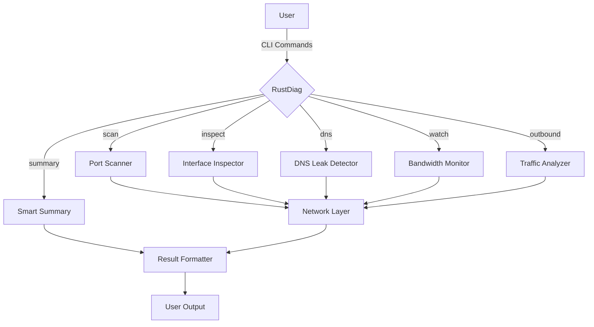
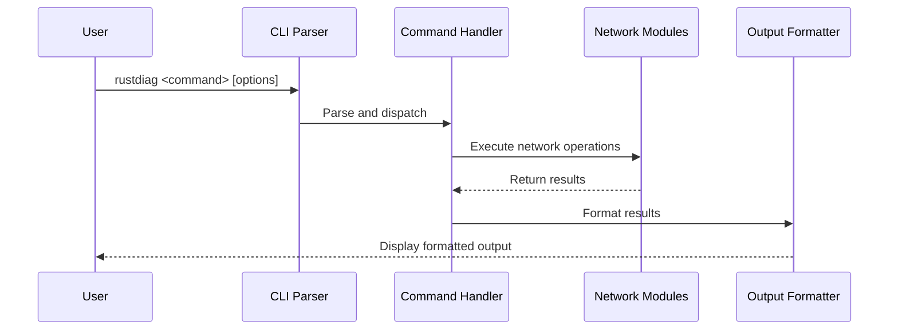
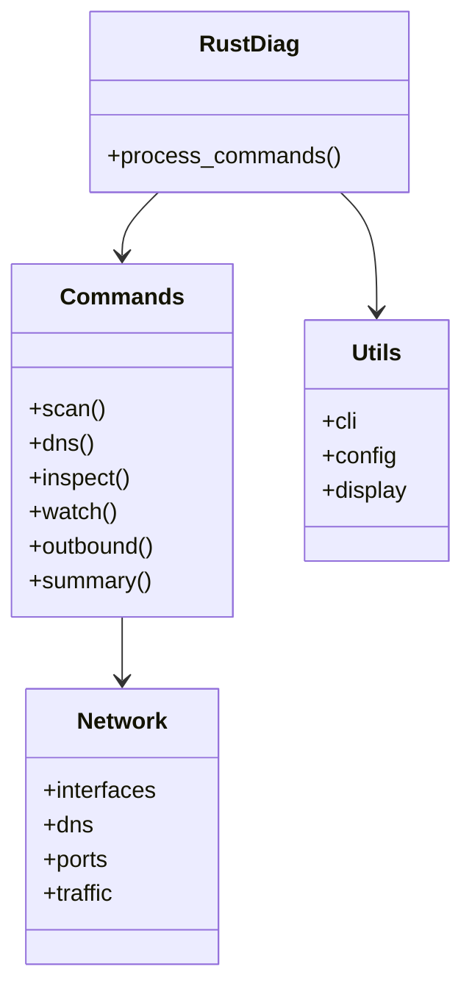

# RustDiag

> **RustDiag** — a blazing-fast, secure, and human-friendly network diagnostic tool built in Rust.  
> Your local microscope for the web of connections, ports, leaks, and traffic around you.

<p align="center">⚠️ <b>UNDER ACTIVE DEVELOPMENT</b> ⚠️</p>
<p align="center"><i>RustDiag is actively being developed following Test-Driven Development principles.</i></p>

---

## What is RustDiag?

RustDiag is a modern, open-source CLI that helps you **understand, diagnose, and monitor your network environment** — from your local ports and DNS config, to suspicious outbound traffic and potential leaks.

It's like a Swiss Army knife for your digital senses:
- **Port Scanning** (lightweight and stealthy)
- **Interface Inspection** (IPs, MACs, states)
- **DNS Leak Testing**
- **Live Bandwidth Monitoring**
- **Outbound Traffic Analysis** (with geolocation)
- **Smart Summary Mode** (What changed since last run?)

No cloud. No bloat. Just clear, fast, and extensible network insight — powered by Rust.

### Architecture Overview



### Command Flow



---

## Why RustDiag?

> Because devs, hackers, students, and everyday humans deserve to *see* what their machines are really doing. Also, fully open source.

The current landscape of network tooling is:
- Fragmented (`ifconfig`, `netstat`, `lsof`, `nmap`, `tcpdump`…)
- Archaic (decades-old tools with cryptic flags)
- Unsafe or opaque (written in C, no sandboxing, hard to extend)

**RustDiag is different:**
- Secure-by-default (Rust memory safety, no random segfaults)
- Modular (each feature can be used or embedded separately)
- Designed for humans (clear logs, summaries, intuitive UX)
- Runs anywhere (Linux, macOS, WSL, containers, Raspberry Pi)

---

## Development Status (Milestone-Driven Roadmap)

RustDiag is being built following Test-Driven Development (TDD) principles, where tests are written before implementation. This ensures robust, well-tested code.

### MVP: v0.1.x — *"Wire Whisperer"* (Current Version: 0.1.1)
- [x] CLI interface with subcommands: `scan`, `dns`, `inspect`, `watch`, `outbound`, `summary`
- [x] Async TCP port scanner (IPv4 focus first)
- [x] Interface inspector (names, IPs, MACs, MTU)
- [x] Bandwidth monitor via `sysinfo`
- [x] DNS leak test using `trust-dns-resolver`
- [x] Basic outbound traffic analysis
- [x] Smart summary foundation
- [ ] Interface state detection (in progress)
- [ ] Service detection in port scanning (in progress)
- [ ] Geolocation for outbound IPs (in progress)

### v0.2.x — *"TUI & Timeline"* (Planned)
- [ ] Terminal-based UI (via `tui-rs` or `ratatui`)
- [ ] Live traffic timeline visualization
- [ ] Delta diff: detect what changed since last run

### v0.3.x — *"Extenders & Plugins"* (Planned)
- [ ] JSON + HTML report export
- [ ] Plugin API: let others add modules (e.g., Tor detection, container awareness)
- [ ] WASM-based safe plugin execution

### v1.0 — *"The Developer's Network Ally"* (Planned)
- [ ] Fully tested and cross-platform stable build
- [ ] Optional daemon mode for background monitoring
- [ ] Build into CI/CD pipelines

## Installation & Usage

### Installation

```bash
# Not yet published to crates.io - install from source:
git clone https://github.com/yourusername/rustdiag.git
cd rustdiag
cargo build --release
```

### Usage

```bash
# Basic commands
rustdiag scan localhost --ports 1-1000  # Scan ports
rustdiag dns example.com                # Test DNS resolution and check for leaks
rustdiag inspect                        # Inspect all network interfaces
rustdiag inspect --interface eth0       # Inspect specific interface
rustdiag watch --interface eth0 -t 5    # Monitor bandwidth for 5 seconds
rustdiag outbound --geo                 # Analyze outbound traffic with geolocation
rustdiag summary                        # Generate a comprehensive network report
```

## Module Structure



---

## Who Is This For?

| Role | Use Case |
|------|----------|
| New Developers | "Am I exposing anything on my VPS?" |
| Senior Engineers | "Why is this container randomly failing outbound checks?" |
| DevOps / SREs | "Is this environment leaking DNS or resolving wrong?" |
| Students | "How do networks actually work?" |
| Hackers / Red Teamers | "Can I stealth scan this box without `nmap`?" |
| Weird Builders (like us) | "What if I turned outbound traffic into music?" |

---

## Built With

- Rust (async-first, memory-safe)
- `tokio` – async runtime
- `clap` – CLI framework
- `pcap`, `pnet` – network interface access
- `trust-dns-resolver` – DNS functionality
- `sysinfo` – system monitoring
- `reqwest` – API requests for geolocation
- `anyhow`, `thiserror` – error handling
- `tracing`, `tracing-subscriber` – logging

---

## Test-Driven Development

RustDiag follows strict TDD practices:
1. Write tests first for new functionality
2. Implement the minimal code to pass tests
3. Refactor while maintaining test coverage

This approach ensures:
- High code quality
- Comprehensive test coverage
- Modular, maintainable components
- Clear documentation of expected behavior

All major features have corresponding tests that validate their functionality.

---

## Contributing

This is open source not just in license, but in **spirit**.  
Feel free to fork, hack, suggest modules, or build whole alternate versions. This is just the beginning.

Contributing is easy:
1. Fork the repository
2. Create a feature branch
3. Write tests for your new feature
4. Implement your feature
5. Submit a pull request

---

## License

MIT — Do what you want, just don't use it for evil. Or worse: ads.
